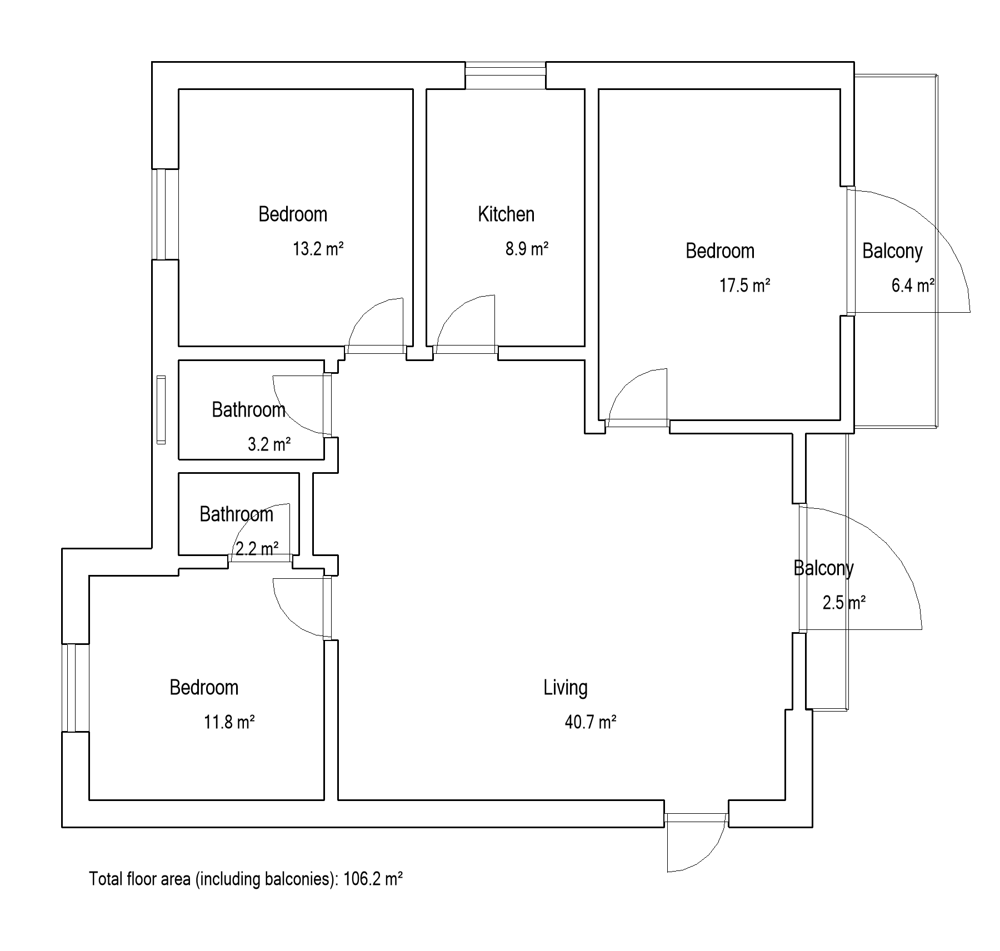
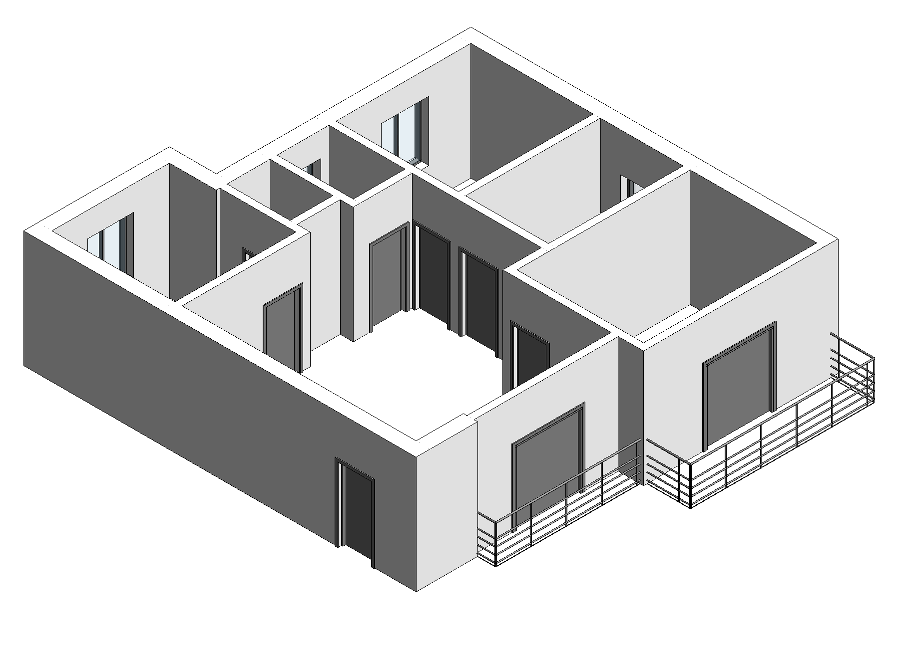

# Text2Revit

[中文](README.zh.md)

**Generate apartment layouts from text and turn them into editable Revit models.**

Text2Revit uses a conditional Flow Matching model to generate room layouts from a supported English prompt. A Python pipeline refines the geometry and places openings, then a C# add-in builds the result as native Autodesk Revit elements. The repository includes data preparation, model training, inference and the Revit integration.

## Example

```text
A large 3-bedroom apartment with 2 bathrooms and 2 balconies.
```

The images below show the same generated apartment in Revit 2022: **3 bedrooms, 2 bathrooms, 2 balconies and 106.2 m² total floor area**, including balconies.




The [sample](sample/README.md) includes the generated JSON and native Revit measurements.

## What it generates

- Editable 3D walls, hosted door and window families, rooms and open balcony railings.
- Room areas and total floor area on the plan, together with a shaded 3D view.
- Room-specific window heights and sill heights, sampled in 100 mm increments.
- Geometry checks and regeneration for unsuitable layouts, including kitchens or bathrooms below 2 m².

Window placement avoids the continuous exterior wall containing the entrance. Bedrooms with balcony access receive a balcony door without an additional window. Narrow geometry is repaired before door and window placement, and opening positions are checked for spacing. See the [user guide](revit/guide.md) for dimensions and the [validation report](docs/audit.md) for the checks and their limits.

## Use in Revit

1. Download `Text2Revit-Setup.exe` from the [Windows release](https://github.com/Simon777hh/Text2Revit/releases). Close Revit, run the installer and select **Install**.
2. Start Revit, open a project floor plan and select **Text2Revit → Generate Model**.
3. Enter a supported prompt and select **Generate**. The tool creates the model and opens its 3D view.

The Windows online installer automatically downloads and installs Python, PyTorch, CLIP and the trained model. Only the setup EXE needs to be downloaded manually. Installation requires internet access; subsequent inference runs locally and offline, uses a compatible NVIDIA GPU automatically and supports CPU fallback. No separate Python or Conda installation is required. A complete offline installer can also be distributed separately.

English is the default interface; Chinese is available in the installer and prompt dialog. Both interfaces use the same English prompt format.

### Prompt format

```text
A small 2-bedroom apartment with 1 bathroom and 1 balcony.
A 3-bedroom apartment with 2 bathrooms and 1 balcony.
A large 4-bedroom apartment with 2 bathrooms and 2 balconies.
```

| Condition | How to specify it |
| --- | --- |
| Apartment size | Use `small` or `large`; omit the size for medium |
| Bedrooms | Change the bedroom count |
| Bathrooms | Change the bathroom count |
| Balconies | Change the balcony count |

Each layout includes one living room and one kitchen. The current prompt interface supports these four conditions; other design requirements are not exposed as prompt controls.

### Compatibility

The installer contains separate add-ins for **Revit 2020–2026** and registers each under its matching version. There is no manual DLL selection. All seven targets have been compiled; native model generation has been verified in **Revit 2022**. Runtime validation in the other versions and installation on a clean external PC remain pending.

## Run inference from source

The locally verified environment is Windows x64 with Python 3.14 and PyTorch 2.11. Model weights are not included in the source repository. To run inference from source, provide a compatible trained checkpoint at `checkpoints/flow_matching_best.pth`, or pass its path with `--checkpoint`. The Windows installer supplies the weights needed for Revit use automatically.

In a Python environment, run the following from the repository root:

```powershell
python -m pip install -r requirements.txt
python scripts/setup_models.py
python pipeline_generate.py --prompt "A 3-bedroom apartment with 2 bathrooms and 1 balcony."
```

The setup script downloads the CLIP text encoder once. Inference loads `checkpoints/flow_matching_best.pth` and writes its JSON and preview to `outputs/`. Use `--checkpoint` and `--clip-dir` to supply alternative model paths. See [checkpoint details](checkpoints/README.md) for provenance and the checksum.

## Data, training and development

| Location | Contents |
| --- | --- |
| `preprocessing/resplan/`, `preprocessing/rplan/` | Dataset cleaning, wall reconstruction, filtering and coordinate preparation |
| `preprocessing/features/` | Ground truth, topology, prompts, masks, edge mapping, CLIP embeddings and validation |
| `model.py`, `train.py`, `losses.py` | Model architecture and Flow Matching training |
| `pipeline_generate.py`, `backend_cli.py` | Inference and output generation |
| `geometry_cleanup.py`, `plan_quality.py`, `door_window_rules.py`, `revit_geometry.py` | Geometry repair, area checks, opening placement and physical dimensions |
| `revit/` | C# add-in, installer and release builder |
| `sample/`, `tests/`, `docs/` | Examples, regression checks and documentation |

Training datasets are obtained separately. The [data pipeline](docs/data_pipeline.md) describes preparation and validation; the [development guide](docs/development.md) covers the C# implementation, installer builds and verification commands. The [validation report](docs/audit.md) records tested behavior and remaining limitations.

## License

Copyright (c) 2026 Simon H.

Text2Revit is available under the [Source-Available Evaluation License](LICENSE). You may clone, study and privately run or modify it for noncommercial evaluation. Commercial use, substantial reuse in other projects and redistribution beyond the license's permissions require prior written permission.

Third-party components and datasets retain their own terms. See [third-party notices](THIRD_PARTY_NOTICES.md).
